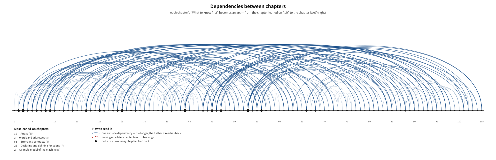

# Proven C Book — An Introduction to Modern C with the Proven C Library

This book serves as both an introduction to the C language and an introduction to
the proven C library. It is written for readers from beginners in C through to
those who have just finished a first textbook.

*[한국어판 README](README.md)*

> Why do integers wrap around? Why is a pointer not simply a number? What does a
> compiler promise, and what does it refuse to promise?
>
> This book is not a list of syntax; it is **a book that answers those
> questions**. It starts from how a computer is actually built, takes C23 as its
> default, and ends as a manual for the
> [proven](https://github.com/rubidus-api) C library.

- **Current edition**: v0.54.0 — **draft**
- **Download the PDF** — [English PDF](https://github.com/rubidus-api/proven_c_book/releases/download/v0.54.0/proven_c_book-v0.54.0-en.pdf) · [Korean PDF](https://github.com/rubidus-api/proven_c_book/releases/download/v0.54.0/proven_c_book-v0.54.0-ko.pdf)
- **Read on the web** — [English](https://rubidus-api.github.io/proven_c_book/en/) · [한국어](https://rubidus-api.github.io/proven_c_book/ko/)
- **Bundles (zip)** — [en](https://github.com/rubidus-api/proven_c_book/releases/download/v0.54.0/proven_c_book-v0.54.0-en.zip) · [ko](https://github.com/rubidus-api/proven_c_book/releases/download/v0.54.0/proven_c_book-v0.54.0-ko.zip) · [all](https://github.com/rubidus-api/proven_c_book/releases/download/v0.54.0/proven_c_book-v0.54.0-all.zip)
- Copies inside the repository: [en PDF](dist/proven_c_book-v0.54.0-en.pdf) · [ko PDF](dist/proven_c_book-v0.54.0-ko.pdf)
- **Style specimen** — every device the book uses, gathered in one place, with each
  element labelled by its own name (CSS selector on the web, function name in the
  typeset edition). Always current, independently of releases:
  [web](https://rubidus-api.github.io/proven_c_book/style-specimen.html) ·
  [PDF](https://rubidus-api.github.io/proven_c_book/style-specimen.pdf)
- 13 parts, 98 chapters, appendices A–F and an index — 914 pages in English, 861 in Korean.
- The change log lives in [CHANGELOG.md](CHANGELOG.md).

## What kind of book is this

C carries scars left by a long history. Why the null pointer became a thing that
"is zero and yet is not zero"; why one character split into several character
sets; why `signal` entered the standard as the common denominator rather than as
the fixed version — these places cannot be crossed by memorising syntax, and the
accidents come later at exactly those places.

This book **walks through them one at a time**. Every chapter opens with "what to know
first → looking back → by the end of this chapter → the questions this chapter
answers", and the body alternates between explanation,
question-and-answer, common misconceptions, real cases and counter-examples.
There are no exercises: the choice was a book that can be read through without
strain, at the cost of leaving practice to other books and to your own programs.

**The first program comes late.** Hello world does not appear until Part III.
Before it, the book establishes how memory is divided, how numbers and letters
are represented, and why the cache governs speed. If you would rather build
something first, read chapter 15 and then come back to chapter 1.

## What is inside

| Parts | What it does | Chapters like these |
| --- | --- | --- |
| I–II | How a computer is actually built | The ladder of registers and caches / IEEE 754 as a contract / Characters and text — scars inside the standard |
| III–IV | The first program and a minimal toolbox | Hello world / The landscape of working C compilers |
| V–VI | Declarations, values, control flow | **The map of types — how the standard divides them** / Implicit conversions — promotion and the usual arithmetic conversions / Loops and invariants |
| VII | **Memory** | **Loop techniques — nesting, escaping, `do{}while(0)`** / Null — the three siblings handled properly / The rules of pointers: alignment and provenance / Multidimensional arrays / Lifetime and storage duration |
| VIII–IX | The shape of data, and the deep corners | Unions and representation / Floating point as approximation / **Undefined behaviour** |
| X | Composition | **The world of names — four name spaces and three axes** / **Handling name collisions — from prefixes to `namespace`** / The preprocessor and translation phases / Functions as values |
| XI | **The standard library, closely read** | Streams in practice / Signals / Non-local jumps / Locales (two chapters) / Wide characters (two chapters) / Unicode in practice / Inside the allocator |
| XII | **proven — proven fundamentals** | Five bugs still shipping after 50 years / Errors are values / Allocation is a parameter / Writing it three ways — a small JSON reader |
| XIII | Closing | C in practice / The embedded toolbox / Modern C, gathered up |

The appendices are an operator table, a full account of `printf`/`scanf`
formats, a summary of implicit conversions, further reading with the standard
documents, and the complete C grammar in EBNF.

## What makes it different

- **Every printed output is real.** All 160 listings are compiled and run on
  every build and their output is pasted into the page (GCC, cross-checked with
  Clang). Not one line of output was copied by hand.
- **Claims are measured by running code.** Statements such as "at `-O2` a
  non-`volatile` local reverts to its old value after a `longjmp`" carry the
  result of actually building at both optimization levels. What the standard can
  settle is settled from the standard; what only a machine can settle is settled
  by a machine.
- **Today's C.** C23 is the default. `bool`, `nullptr`, `[[noreturn]]` and
  `<stdckdint.h>` appear from the start, and older practice is treated as
  history.
- **Two editions, published together.** Korean and English, with the listings
  split per edition too (the English edition uses `examples-en/`, where comments
  and printed output are in English). Both trees are verified in full on every
  build.
- **Written with AI as an assisting tool.** The structure, the policies and what
  goes in were decided and reviewed by the author, and the listings are verified
  by a machine on every build — whoever wrote it, *code that does not run does
  not go into this book.*

> **What that verification covers.** It reaches exactly this far: *the examples
> build and run in this environment, and the output on the page came from that
> run* (x86-64 Linux, GCC as the base with Clang as a cross-check). It is not an
> audit of the book's prose against the standard, not a security audit, and not
> validation by large-scale real use. The prose is grounded separately, in clauses
> of the standard and primary sources; the verified scope and the limits of the
> bundled proven library are tabulated in chapters 86 and 94.

## Dependencies between chapters

Each chapter opens with "What to know first", which is itself a declaration of
dependency, so those entries are extracted and drawn as a graph. It is not a
hand-drawn picture but one *generated from the manuscript*, so it cannot drift.

[](docs/DEPENDENCIES-en.md)

The horizontal axis runs from chapter 1 to 96, and each arc is one dependency ---
from the chapter leaned on (left) to the chapter itself (right). The longer the arc,
the further back it reaches; the bigger the dot, the more chapters lean on it. Any
chapter leaning on a later one shows up as a red dashed arc.

- As tables — [DEPENDENCIES-en.md](docs/DEPENDENCIES-en.md) · [한국어](docs/DEPENDENCIES.md)
- A finer grain — [the section map](docs/SECTIONS.md): forward references, difficulty, kind and size for all 499 sections
- Terms — [the Korean–English glossary](docs/TERMS.md): 209 concept terms and where each is defined
- To regenerate — `python3 scripts/make-depgraph.py`, `scripts/section-map.py`, `scripts/check-terms.py`

## Running the listings yourself

Every listing in the book is in this repository and can be built and run in one
go.

```sh
scripts/verify-examples.sh              # build + run + capture output, Korean tree
scripts/verify-examples.sh examples-en  # the English tree
CC=clang scripts/verify-examples.sh     # cross-check with another compiler
```

- A C23 compiler is required (GCC 14+ or Clang 16+).
- Listings that `#include <proven...>` build `vendor/proven` alongside them
  automatically.

> The manuscript (Typst sources) and the typesetting scripts are not published.
> The `scripts/` directory here holds only the verification and checking tools.
> What this repository carries is the finished book (PDF and HTML) and the
> listing code.

## Layout

```
dist/        Distribution — PDFs (ko, en) and zip bundles
docs/        The HTML edition served by GitHub Pages (ko/, en/)
examples/    The 160 listings that appear in the book — all verified
examples-en/ The same listings in English (comments, strings, output)
scripts/     Listing verification scripts
vendor/      A snapshot of the proven library (for linking the listings)
```

## Licence

- **The text** (the generated PDF and HTML): **CC BY-NC-SA 4.0** —
  [LICENSE](LICENSE) in this repository is authoritative. You may share and
  adapt it with attribution, but not commercially, and adaptations must carry
  the same licence.
- **The listing code** (`examples/`, `examples-en/`, `scripts/`): **MIT** —
  [LICENSE-CODE](LICENSE-CODE). Code learned from the book may be reused without
  restriction.
- `vendor/proven/`: under the licence of the original work.

Details are in [LICENSE-NOTICE.md](LICENSE-NOTICE.md).

---

This is a draft, so errors remain. Wrong statements, listings that do not run and
typos are gratefully received as issues. Contact: rubidus@gmail.com.
