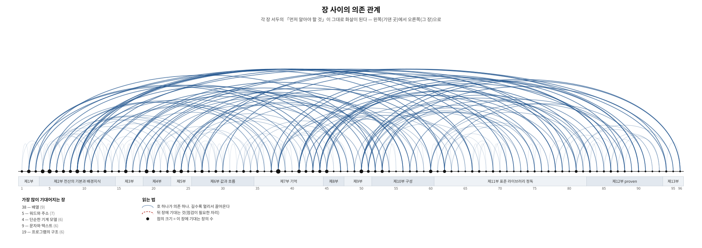

# Proven C Book — 프로븐 C 라이브러리와 함께하는 현대적 C 입문

이 책은 C언어 입문서와, 프로븐 C 라이브러리의 입문서를 겸하고 있습니다.
대상은 C언어 입문자부터 막 기본서를 뗀 중급자까지입니다.

*[English README](README-en.md)*

> 정수는 왜 감아 도는가. 포인터는 왜 그냥 숫자가 아닌가. 컴파일러는 무엇을
> 약속하고 무엇을 약속하지 않는가.
>
> 이 책은 문법 목록이 아니라 **그 질문들에 답하는 책**이다. 컴퓨터가 어떻게
> 생겼는지에서 출발해, C23을 기본값으로 삼고, 마지막 부에서
> [proven](https://github.com/rubidus-api) C 라이브러리로 이어진다.

- **현재 판**: v0.58.1 — **초안(draft)**
- **PDF 바로 받기** — [한국어 PDF](https://github.com/rubidus-api/proven_c_book/releases/download/v0.58.1/proven_c_book-v0.58.1-ko.pdf) · [English PDF](https://github.com/rubidus-api/proven_c_book/releases/download/v0.58.1/proven_c_book-v0.58.1-en.pdf)
- **웹으로 읽기** — [한국어](https://rubidus-api.github.io/proven_c_book/ko/) · [English](https://rubidus-api.github.io/proven_c_book/en/)
- **묶음(zip)** — [ko](https://github.com/rubidus-api/proven_c_book/releases/download/v0.58.1/proven_c_book-v0.58.1-ko.zip) · [en](https://github.com/rubidus-api/proven_c_book/releases/download/v0.58.1/proven_c_book-v0.58.1-en.zip) · [전체](https://github.com/rubidus-api/proven_c_book/releases/download/v0.58.1/proven_c_book-v0.58.1-all.zip)
- 저장소 안 사본: [ko PDF](dist/proven_c_book-v0.58.1-ko.pdf) · [en PDF](dist/proven_c_book-v0.58.1-en.pdf)
- **서식 예시(style specimen)** — 책에 쓰이는 모든 장치를 한자리에 모아 둔 견본이다.
  각 요소 옆에 그 이름(웹은 CSS 선택자, 텍스트 판은 함수 이름)이 붙어 있다.
  판을 내지 않고도 늘 최신이다:
  [웹](https://rubidus-api.github.io/proven_c_book/style-specimen.html) ·
  [PDF](https://rubidus-api.github.io/proven_c_book/style-specimen.pdf)
- 13부 98장 + 부록 A~F + 찾아보기 — 한국어판 835쪽, 영어판 894쪽
- 갱신 내역은 [CHANGELOG.md](CHANGELOG.md)에 있다.

## 어떤 책인가

C에는 오랜 역사가 남긴 흉터가 있다. 널 포인터가 왜 「0인데 0이 아닌」 것이
되었는지, 문자 하나가 왜 여러 벌의 문자집합으로 갈라졌는지, `signal`이 왜
고쳐진 판이 아니라 공통분모로 표준에 들어왔는지 — 이런 자리들은 문법을 외워서는
넘을 수 없고, 넘지 못하면 나중에 정확히 그 자리에서 사고가 난다.

이 책은 그 자리들을 **하나씩 짚어 가며 읽는 책**이다. 각 장은 「먼저 알아야 할
것 → 돌아보기 → 이 장이 끝나면 → 이 장에서 답할 질문」으로 열고, 본문은
설명·즉문즉답·흔한 오해·실제 사례·반례가 번갈아 나온다. 연습문제는 없다.
부담 없이 끝까지 읽히는 쪽을 택했고, 그 대가로 수행 훈련은 다른 책과 자기
프로그램에 맡겼다.

**첫 프로그램이 늦다.** 헬로 월드는 제3부에서야 나온다. 그전까지는 기억이
어떻게 나뉘는지, 수와 글자가 어떻게 표현되는지, 캐시가 왜 속도를 지배하는지를
세운다. 빨리 만들어 보고 싶다면 15장부터 읽고 1장으로 돌아와도 좋다.

## 무엇이 들어 있나

| 부 | 무엇을 하는가 | 이런 장이 있다 |
| --- | --- | --- |
| 1~2부 | 컴퓨터가 어떻게 생겼는지 | 기억의 분화 — 레지스터·캐시·다층의 사다리 / 수의 표현 — IEEE 754라는 계약 / 문자와 텍스트 — 표준 속의 흉터 |
| 3~4부 | 첫 프로그램과 최소 도구 | 헬로 월드 / 컴파일러의 지형 — 현역 C 컴파일러들 |
| 5~6부 | 선언·값·흐름 | **타입의 지도 — 표준이 가른 것들** / 암묵적 변환 — 승격과 통상 산술 변환 / 반복 — 루프와 불변식 |
| 7부 | **기억** | **반복의 기법 — 중첩, 탈출, `do{}while(0)`** / 널 — 삼형제의 정식 취급 / 포인터의 규칙 — 정렬과 프로버넌스 / 다차원 배열 / 수명과 저장 기간 |
| 8~9부 | 자료의 모양과 깊은 구석 | 공용체와 표현 / 실수 — 근사의 수학 / **정의되지 않은 동작** |
| 10부 | 구성 | **이름의 세계 — 네 이름 공간과 세 축** / **이름 충돌을 다루는 법 — 접두어에서 `namespace`까지** / 전처리기와 번역 단계 / 함수를 값으로 |
| 11부 | **표준 라이브러리 정독** | 스트림의 실제 / 신호 `<signal.h>` / 비지역 점프 `<setjmp.h>` / 로케일 두 장 / 와이드 문자 두 장 / 실무의 유니코드 / 할당자의 속 |
| 12부 | **proven — 새로운 안정적인 기반** | 50년째 출하되는 다섯 가지 버그 / 에러는 값이다 / 할당은 매개변수다 / 세 판으로 짜 보기 — 간이 JSON |
| 13부 | 닫으며 | 실전의 C / 임베디드의 도구 상자 / 모던 C 총정리 |

부록은 연산자 조회표, `printf`·`scanf` 서식 완전 정리, 암묵 변환 요약, 더
읽을거리와 표준 문서, C 문법 전문(EBNF) 다섯이다.

## 이 책이 다른 점

- **인쇄된 실행 결과는 전부 실제 출력이다.** 예제 160개를 매 빌드마다
  컴파일·실행해 그 출력을 지면에 싣는다(GCC 기준, Clang으로 교차 검증).
  사람이 옮겨 적은 출력은 한 줄도 없다.
- **주장을 재려고 코드를 돌린다.** "`-O2`에서는 `longjmp` 뒤에 비 `volatile`
  지역 변수가 옛 값으로 되돌아간다" 같은 서술은 실제로 두 최적화 수준으로
  빌드해 확인한 결과를 싣는다. 표준 문서로 확인할 것은 표준 문서로, 기계로
  확인할 것은 기계로 확인했다.
- **오늘의 C.** C23이 기본값이다. `bool`·`nullptr`·`[[noreturn]]`·
  `<stdckdint.h>`가 처음부터 나오고, 옛 관행은 역사로만 다룬다.
- **두 판을 함께 낸다.** 한국어판과 영어판, 그리고 예제까지 판마다 갈라
  둔다(영어판은 주석과 출력 문구가 영어인 `examples-en/` 트리). 두 트리 모두
  매 빌드마다 전수 검증한다.
- **AI를 보조 도구로 삼아 집필했다.** 구성·방침·수록 여부는 저자가 정하고
  검토했으며, 예제는 기계가 매번 실제로 돌려 검증한다 — 누가 썼든 *돌지 않는
  코드는 이 책에 실리지 않는다*.

> **검증이 뜻하는 범위.** 위의 검증은 *예제가 이 환경에서 빌드되고 돌며, 지면의
> 출력이 그 실행에서 나왔다*는 사실까지다(x86-64 리눅스, GCC 기준·Clang 교차).
> 이는 책의 모든 서술에 대한 표준 적합성 감사도, 보안 감사도, 대규모 실사용
> 검증도 아니다. 서술의 근거는 표준 조항과 1차 자료로 따로 대며, 함께 실린
> proven 라이브러리의 검증 범위와 한계는 86·94장에 표로 적어 두었다.

## 장 사이의 의존 관계

각 장 서두의 「먼저 알아야 할 것」이 곧 의존 선언이라, 그것을 그대로 뽑아 관계도로
그린다. 손으로 그린 그림이 아니라 *원고에서 생성한 것*이라 원고와 어긋나지 않는다.

[](docs/DEPENDENCIES.md)

가로축이 1장부터 98장까지이고, 호 하나가 의존 하나다 — 왼쪽(기댄 곳)에서
오른쪽(그 장)으로 걸린다. 호가 길수록 멀리서 끌어오는 것이고, 점이 클수록 여러
장이 그 장에 기댄다. 뒤 장에 기대는 자리가 있으면 붉은 점선으로 드러난다.

- 표로 보기 — [DEPENDENCIES.md](docs/DEPENDENCIES.md) · [English](docs/DEPENDENCIES-en.md)
- 더 잔 눈금 — [절 단위 지도](docs/SECTIONS.md): 499개 절의 앞질러 참조·난이도·성격·분량
- 용어 — [한국어–영어 대조표](docs/TERMS.md): 개념어 209개와 그 정의 장
- 다시 만들기 — `python3 scripts/make-depgraph.py`, `scripts/section-map.py`, `scripts/check-terms.py`

## 예제 직접 돌려 보기

본문에 실린 예제는 전부 이 저장소에 있고, 한 번에 빌드·실행해 볼 수 있다.

```sh
scripts/verify-examples.sh              # 한국어판 예제 전수 빌드 + 실행 + 출력 캡처
scripts/verify-examples.sh examples-en  # 영어판 예제 트리
CC=clang scripts/verify-examples.sh     # 다른 컴파일러로 교차 검증
```

- C23 컴파일러가 필요하다(GCC 14+ 또는 Clang 16+).
- `#include <proven...>`을 쓰는 예제는 `vendor/proven`이 자동으로 함께
  빌드된다.

> 원고(Typst 소스)와 조판 스크립트는 공개하지 않는다. 저장소의 `scripts/`에는
> 예제 검증과 점검 도구만 둔다. 이 저장소가 담는 것은 완성된 책(PDF·HTML)과
> 예제 코드다.

## 구성

```
dist/        배포물 — PDF(ko·en)와 zip 묶음
docs/        GitHub Pages 가 서비스하는 HTML 판 (ko/, en/)
examples/    본문에 실리는 예제 160개 — 전부 검증된 것
examples-en/ 같은 예제의 영어판 (주석·문자열·출력이 영어)
scripts/     예제 검증 스크립트
vendor/      proven 라이브러리 스냅샷 (예제 링크용)
```

## 라이선스

- **본문**(생성된 PDF·HTML): **CC BY-NC-SA 4.0** — 저장소의
  [LICENSE](LICENSE)가 정본이다. 출처를 밝히면 공유·개작할 수 있으나
  영리 이용은 불가하며, 개작물에도 같은 라이선스를 적용해야 한다.
- **예제 코드**(`examples/`, `examples-en/`, `scripts/`): **MIT** — [LICENSE-CODE](LICENSE-CODE).
  책에서 배운 코드는 제약 없이 가져다 쓸 수 있다.
- `vendor/proven/`: 원저작물의 라이선스를 따른다.

자세한 안내는 [LICENSE-NOTICE.md](LICENSE-NOTICE.md)에 있다.

---

초안이므로 오류가 남아 있을 것이다. 틀린 서술, 동작하지 않는 예제, 오탈자를
발견하면 이슈로 알려 주시면 고맙게 반영한다. 연락은 rubidus@gmail.com.
